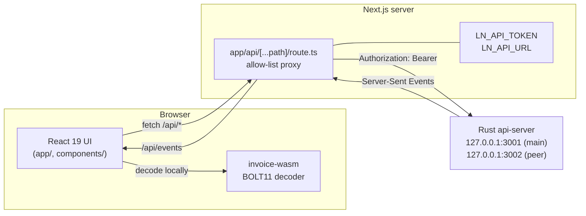
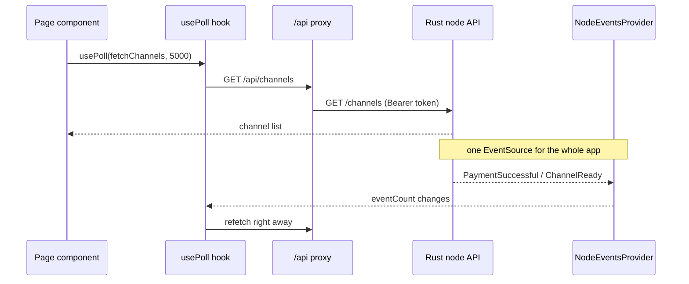

# Lightning Tool: web frontend

A Next.js web app for learning and driving the Lightning Network on **regtest**. It has two halves:

- **An invoice decoder** that runs the Rust BOLT11 decoder **in your browser through WebAssembly**. No invoice is ever
  sent to a server.
- **A node dashboard** to fund a wallet, open channels, create invoices, pay them and watch balances move live, with
  clear error messages when something cannot be done.

> The Rust backend lives in [ligthening-node/backend](https://github.com/ligthening-node/backend). The scripts that start
> the whole stack with one command live in [ligthening-node/lightning-tool](https://github.com/ligthening-node/lightning-tool).

---

## Table of contents

- [Features](#features)
- [Architecture](#architecture)
- [Quick start](#quick-start)
- [Configuration](#configuration)
- [Pages](#pages)
- [Code snippets](#code-snippets)
- [Generated code](#generated-code)
- [Testing](#testing)
- [Docker](#docker)
- [Project layout](#project-layout)

---

## Features

| Feature | Description |
|---|---|
| **In-browser decoder** | Paste a BOLT11 invoice and see a color-coded anatomy, every field explained, and a list of checks with a clear verdict. |
| **Dashboard** | Node status, on-chain and Lightning balances, and live notifications for payments and channel changes. |
| **Channels** | Open and close channels. A channel can only be opened with a peer that is connected right now: the form shows "Not connected to this peer" or "This peer is disconnected" and keeps the button disabled. Each channel shows its state and the total it is allowed to transact, with how much is left to send and receive. |
| **Send** | Paste an invoice, review it, then pay. The app explains in words why a payment cannot go out. |
| **Receive** | Create an invoice with an amount, description and expiry, shown as text and a QR code. |
| **Wallet** | Get an on-chain address and send on-chain. |
| **Payments** | History with status (pending, succeeded, failed), direction and amount. |
| **Two nodes, two UIs** | Run a second copy of the app against the peer node, so you can be both sides of a payment. |
| **Light and dark theme**, motion toggle | Respects `prefers-reduced-motion`. |

### Channel states and the transaction allowance

| Badge | Meaning |
|---|---|
| **Still open** | The channel is usable and still has balance to send. |
| **Completed** | The channel's allowance is used up: nothing spendable is left to send (or, on the receiving side, to receive). |
| **Confirming 2/6** | The funding transaction needs 6 confirmations. |
| **Peer offline** | The channel is ready but the peer is not connected. |

There is no range bar. Each channel shows three numbers instead:

| Number | Meaning |
|---|---|
| **Total allowed to transact** | Fixed for the life of the channel: its size, minus 660 sat of anchor outputs, minus the reserve the funder keeps. A 1,000,000 sat channel is always 989,340 sat and a 20,000 sat channel always 18,340 sat. Payments never change it. |
| **Left to send** | What is still on your side. It counts down sat by sat as you pay and reaches **0 sat** when the channel is used up. The last few hundred sat the funder can never spend show as 0. |
| **Left to receive** | The same figure for the other side. Both numbers move in opposite directions, so when one node's "left to send" falls, the other node's rises. |

## Architecture



**Security model.** The browser only talks to the Next.js server. The server holds the API token, adds the
`Authorization` header and forwards **only an allow-list of routes**. Anything else is a 404. The token never reaches
client code.

### Data flow



Pages refetch on a timer **and** whenever the node emits a live event, so a payment shows up without waiting for the
next tick.

### Two nodes, one codebase

The same app can talk to either node. `lib/node-role.ts` decides which one from the environment:

```ts
export function nodeRole(env: { NODE_LABEL?: string; LN_API_URL?: string; LN_API_TOKEN?: string }): NodeRole | null {
  const label = env.NODE_LABEL?.trim();
  if (label !== undefined && label !== "") {
    return { label, isPeer: /peer/i.test(label) };
  }
  if (env.LN_API_TOKEN === undefined) {
    return null;
  }
  const isPeer = /:3002\/?$/.test(env.LN_API_URL ?? "");
  return { label: isPeer ? "Peer node" : "Main node", isPeer };
}
```

With no node configured (the public decoder deployment) it returns `null` and the node pages stay hidden.

## Quick start

### Decoder only (no backend needed)

```bash
pnpm install
pnpm dev                    # http://localhost:3000/decode
```

### Full stack against a local node

1. Start the backend as described in the [backend README](https://github.com/ligthening-node/backend#quick-start).
2. Put a token in `.env.local`. It must match the backend's `LN_API_TOKEN` and be at least 16 characters:

   ```bash
   echo "LN_API_TOKEN=$(openssl rand -hex 32)" > .env.local
   ```

3. Start the app:

   ```bash
   pnpm dev                 # main node UI on http://localhost:3000
   ```

4. Optional: a second UI for the peer node:

   ```bash
   LN_API_URL=http://127.0.0.1:3002 NODE_LABEL="Peer node" NEXT_DIST_DIR=.next-peer pnpm dev --port 3003
   ```

Or use the one-command setup in [lightning-tool](https://github.com/ligthening-node/lightning-tool), which starts bitcoind,
both nodes, both UIs, funds the wallets and opens channels for you.

## Configuration

| Variable | Default | Meaning |
|---|---|---|
| `LN_API_TOKEN` | none | Bearer token for the node API. Server side only. Restart `pnpm dev` after changing it. |
| `LN_API_URL` | `http://127.0.0.1:3001` | Which node this app talks to. |
| `NODE_LABEL` | derived from `LN_API_URL` | Name shown in the header, such as `Main node` or `Peer node`. |
| `NEXT_DIST_DIR` | `.next` | Build folder. A second dev server needs its own. |

## Pages

| Route | Purpose |
|---|---|
| `/` | Dashboard: status, balances, live events. |
| `/decode` | Invoice decoder (works without a node). |
| `/channels` | Peers, open a channel, channel list with each channel's transaction allowance. |
| `/send` | Pay an invoice. |
| `/receive` | Create an invoice and QR code. |
| `/wallet` | On-chain address and on-chain send. |
| `/payments` | Payment history. |

## Code snippets

### Decode in the browser

The WebAssembly module is about 350 KB, so it loads on first use and is cached:

```ts
import { decodeInvoice, unixNow } from "@/lib/decoder";

const result = await decodeInvoice(invoice, {
  now_unix: unixNow(),
  expected_network: "regtest",
  expected_payee: null,
  description_preimage: null,
  max_amount_msat: null,
});

if (result.status === "ok") {
  console.log(result.decoded.report.verdict);   // "payable" | "not_payable" | "invalid"
}
```

### Exact amounts, no floating point

Millisatoshi values are strings and are handled as `bigint`, so nothing is lost beyond 2^53. The total a channel may
transact is fixed from its own settings (size, anchors, the funder's reserve), while the unspendable leftover counts as
zero in "left to send":

```ts
import { spendableMsat, totalAllowedMsat } from "@/components/node/channel-allowance";

// channel size 1,000,000 sat, funder reserve 10,000 sat: always 989,340 sat, whatever has been paid
totalAllowedMsat("1000000", "10000", "964340000", "15000000");   // 989340000n
spendableMsat("964340000");                                      // 964340000n  left to send
spendableMsat("371000");                                         // 0n          the funder's leftover: used up
```

### Channel state

```ts
export function channelState(channel: ChannelView): string {
  if (isChannelCompleted(channel)) return "Completed";
  if (channel.is_usable) return "Still open";
  if (channel.is_channel_ready) return "Peer offline";
  if (channel.confirmations_required !== null) {
    return `Confirming ${channel.confirmations ?? 0}/${channel.confirmations_required}`;
  }
  return "Pending";
}
```

### Polling that also reacts to live events

```ts
const channels = usePoll(getChannels, 5000);
// refetches on mount, every 5 s, and whenever the node emits an event
```

### Proxy allow-list

```ts
const ALLOWED: ReadonlySet<string> = new Set([
  "node/status", "node/sync", "wallet/address", "wallet/balance", "wallet/send",
  "peers", "peers/disconnect", "channels", "channels/close",
  "invoices", "payments", "events", "decode",
]);

if (!ALLOWED.has(target)) {
  return errorResponse(404, "not_found", "unknown API route");
}
```

## Generated code

Two folders are generated from the Rust backend and **committed**, so the frontend builds without a Rust toolchain:

| Folder | Content | Tool |
|---|---|---|
| `lib/types/` | TypeScript types for decoder and node responses | ts-rs |
| `lib/invoice-wasm/` | The WebAssembly decoder | wasm-pack |

Both come from the same Rust structs, so the UI and the backend share one schema. After changing the Rust types or the
decoder, regenerate them from the backend repo (cloned next to this one as `backend/`):

```bash
../backend/scripts/build-wasm.sh
```

## Testing

```bash
pnpm lint
pnpm typecheck
pnpm test                   # Vitest, including tests against the real .wasm
pnpm e2e                    # Playwright, decoder suite (no node needed)
E2E_REGTEST=1 pnpm exec playwright test --project=regtest   # against a running regtest stack
```

| Suite | Covers |
|---|---|
| `tests/wasm.test.ts` | The real `.wasm` decoding spec invoices. |
| `tests/lightning-pages.test.tsx` | Channel states, the allowance counting down to 0, channel order, force-close confirmation. |
| `tests/node-pages.test.tsx`, `node-labels`, `node-role` | Node pages and which node is shown. |
| `tests/proxy.test.ts` | The allow-list, token handling and error mapping. |
| `tests/validate.test.ts`, `format.test.ts` | Amount validation and exact formatting. |
| `e2e/decoder.spec.ts` | The decoder in a real browser. Runs in CI. |
| `e2e/regtest.spec.ts` | Full flow against the docker stack, opt in. |

## Docker

```bash
docker build -t lightning-web .
docker run -p 3000:3000 -e LN_API_TOKEN=... -e LN_API_URL=http://host.docker.internal:3001 lightning-web
```

`next.config.ts` uses `output: "standalone"`, so the image holds only what the server needs.

## Project layout

```
frontend/
  app/                        routes: /, /decode, /channels, /send, /receive, /wallet, /payments
    api/[...path]/route.ts    token-holding proxy to the Rust API
  components/
    decoder/                  anatomy, fields, checks, verdict banner
    node/                     dashboard, channels, channel allowance, send, receive, wallet, payments
    shell/                    header, theme and motion toggles, background
    ui/                       shadcn/ui primitives
  lib/
    decoder.ts                lazy-loads the WebAssembly decoder
    use-poll.ts               timer plus live-event refetch
    node-events.tsx           one EventSource for the whole app
    node-role.ts              main node or peer node
    validate.ts, format.ts    exact amount handling
    types/                    generated by ts-rs
    invoice-wasm/             generated by wasm-pack
  tests/ e2e/                 Vitest and Playwright
```

### Stack

Next.js 16 (App Router), React 19, TypeScript, Tailwind CSS 4, shadcn/ui with Base UI, Vitest, Playwright, WebAssembly
(Rust).

## License

No license file has been added yet. Add a `LICENSE` file before reusing the code.
